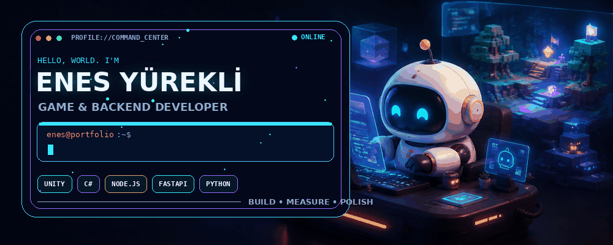

<div align="center">
  
</div>

<h1 align="center">Merhaba, ben Enes 👋</h1>

<p align="center">
  <strong>Unity Oyun Geliştiricisi · C# · Oynanış Sistemleri</strong>
</p>

<p align="center">
  <a href="https://unity.com/"></a>
  <a href="https://learn.microsoft.com/dotnet/csharp/"></a>
  <a href="https://github.com/0Alduin0?tab=followers"></a>
</p>

## Hakkımda

Unity ve C# ile oyun geliştirmeye odaklanan bir Bilgisayar Mühendisliği öğrencisiyim. Oynanış hissi güçlü, bakımı kolay ve performanslı sistemler üretmeyi seviyorum.

- 🎮 Ana odağım: **Unity ile oyun geliştirme**
- 🧩 İlgi alanlarım: oynanış mekanikleri, modüler mimari ve oyun yapay zekâsı
- ⚙️ Çalışma yaklaşımım: prototiple, ölç, iyileştir ve parlat
- 📍 Balıkesir Üniversitesi — Bilgisayar Mühendisliği

## GitHub etkinliğim

<div align="center">
  
</div>

<p align="center">
  <sub>Katkılar, herkese açık depolar, takipçiler ve kullanılan diller GitHub Actions ile her gün yenilenir.</sub>
</p>

## Kullandığım araçlar

```text
Oyun geliştirme  Unity · C# · Oynanış Sistemleri · Oyun Yapay Zekâsı
Mühendislik      Git · GitHub · GitHub Actions · Performans Profilleme
Yaklaşım         Temiz Kod · Modüler Tasarım · Hızlı Prototipleme
```

<p align="center">
  <a href="https://github.com/0Alduin0?tab=repositories"><strong>Herkese açık depolarımı incele →</strong></a>
</p>
